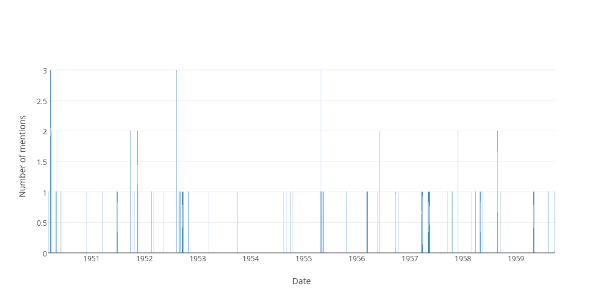

## Sitting days when the word "anzac" was used in the hofreps during the 1950s

| Date | Number of uses |
|--------------|----------------|
|1952-08-06|3|
|1955-04-28|3|
|1950-03-23|3|
|1951-09-27|2|
|1951-11-15|2|
|1950-03-30|2|
|1950-05-09|2|
|1957-11-28|2|
|1958-08-28|2|
|1956-06-07|2|
|1957-03-19|1|
|1952-02-19|1|
|1955-05-03|1|
|1957-10-22|1|
|1953-10-01|1|
|1953-03-17|1|
|1958-03-27|1|
|1951-03-14|1|
|1954-10-14|1|
|1956-05-23|1|
|1957-09-19|1|
|1956-03-15|1|
|1957-05-08|1|
|1954-08-11|1|
|1951-10-24|1|
|1959-04-30|1|
|1959-08-13|1|
|1957-05-02|1|
|1952-10-28|1|
|1952-08-21|1|
|1958-04-22|1|
|1952-08-28|1|
|1950-11-29|1|
|1958-09-17|1|
|1956-09-27|1|
|1952-09-17|1|
|1952-05-06|1|
|1956-03-07|1|
|1951-06-20|1|
|1950-05-03|1|
|1956-03-14|1|
|1955-04-27|1|
|1957-10-16|1|
|1951-11-22|1|
|1957-03-27|1|
|1959-05-07|1|
|1954-09-29|1|
|1955-05-17|1|
|1955-05-10|1|
|1958-08-26|1|
|1951-06-21|1|
|1958-02-25|1|
|1951-06-27|1|
|1954-09-07|1|
|1956-10-17|1|
|1952-09-04|1|
|1952-03-04|1|
|1955-10-20|1|
|1952-09-26|1|
|1951-10-11|1|
|1957-05-16|1|
|1959-09-24|1|
|1950-04-26|1|
|1956-09-26|1|
|1958-05-13|1|
|1950-03-09|1|
|1955-05-05|1|
|1950-06-08|1|
|1958-04-30|1|
|1950-05-31|1|
|1958-05-01|1|
