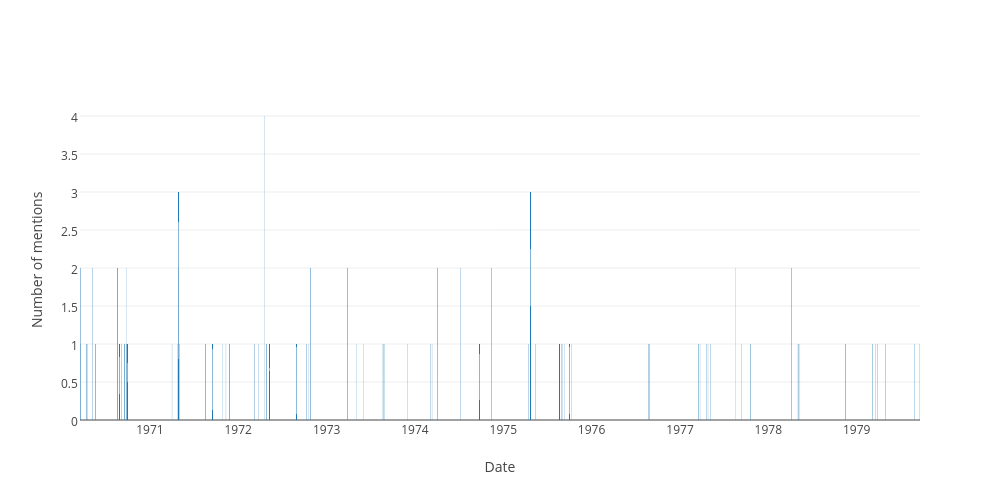

## Sitting days when the word "anzac" was used in the hofreps during the 1970s

| Date | Number of uses |
|--------------|----------------|
|1972-04-20|4|
|1971-04-29|3|
|1975-04-23|3|
|1974-04-03|2|
|1978-04-07|2|
|1972-10-26|2|
|1970-09-24|2|
|1970-08-18|2|
|1977-08-16|2|
|1973-03-27|2|
|1970-03-19|2|
|1971-04-27|2|
|1974-11-12|2|
|1970-08-20|2|
|1970-05-07|2|
|1974-07-09|2|
|1971-11-25|1|
|1970-09-04|1|
|1975-10-08|1|
|1972-05-09|1|
|1971-04-02|1|
|1975-10-01|1|
|1979-09-19|1|
|1975-08-28|1|
|1974-09-24|1|
|1971-04-23|1|
|1978-05-04|1|
|1972-03-09|1|
|1970-04-14|1|
|1974-03-12|1|
|1970-04-16|1|
|1977-03-24|1|
|1971-10-26|1|
|1979-05-01|1|
|1975-08-21|1|
|1970-09-25|1|
|1972-03-23|1|
|1974-03-07|1|
|1979-03-21|1|
|1979-03-29|1|
|1971-11-24|1|
|1973-05-31|1|
|1979-08-29|1|
|1978-05-03|1|
|1977-05-05|1|
|1973-08-21|1|
|1970-03-18|1|
|1972-04-27|1|
|1971-08-18|1|
|1973-11-29|1|
|1970-05-21|1|
|1971-09-16|1|
|1978-05-11|1|
|1977-09-13|1|
|1976-08-26|1|
|1970-09-17|1|
|1975-05-15|1|
|1978-11-16|1|
|1970-09-16|1|
|1977-03-17|1|
|1976-08-24|1|
|1970-09-30|1|
|1979-03-08|1|
|1970-08-28|1|
|1971-11-11|1|
|1972-10-10|1|
|1975-09-09|1|
|1973-05-02|1|
|1972-08-29|1|
|1972-10-19|1|
|1977-04-21|1|
|1977-04-26|1|
|1971-05-04|1|
|1975-04-16|1|
|1973-08-22|1|
|1975-09-04|1|
|1977-10-18|1|
|1973-08-29|1|
