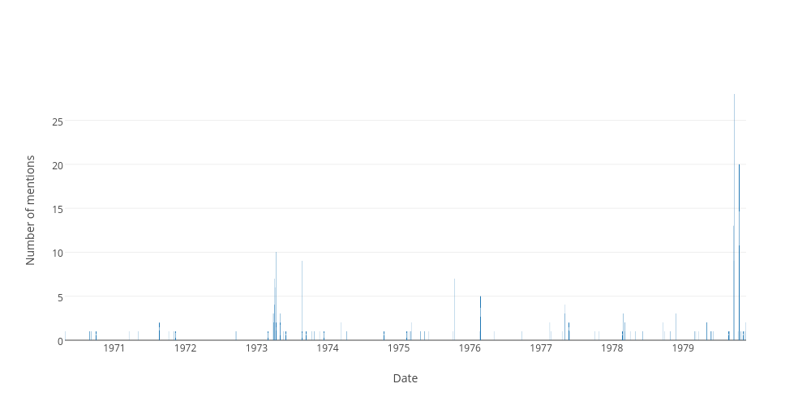

## Sitting days when the word "asio" was used in the hofreps during the 1970s

| Date | Number of uses |
|--------------|----------------|
|1979-09-20|28|
|1979-10-16|20|
|1979-09-18|13|
|1979-10-17|10|
|1973-04-10|10|
|1979-09-19|9|
|1973-08-21|9|
|1975-10-16|7|
|1973-04-04|7|
|1973-04-05|6|
|1976-02-25|5|
|1977-05-05|4|
|1973-04-03|4|
|1977-05-04|3|
|1978-02-28|3|
|1978-11-24|3|
|1973-03-28|3|
|1973-03-27|3|
|1973-05-01|3|
|1977-02-15|2|
|1978-09-21|2|
|1974-03-12|2|
|1979-05-03|2|
|1979-05-02|2|
|1977-05-24|2|
|1971-08-20|2|
|1979-11-20|2|
|1973-04-12|2|
|1973-04-11|2|
|1973-03-29|2|
|1975-03-06|2|
|1973-05-02|2|
|1978-03-08|2|
|1974-04-09|1|
|1979-11-06|1|
|1979-10-10|1|
|1977-10-27|1|
|1970-09-29|1|
|1977-10-06|1|
|1979-11-13|1|
|1977-02-23|1|
|1978-02-23|1|
|1979-02-28|1|
|1970-08-28|1|
|1970-08-27|1|
|1973-10-10|1|
|1971-10-07|1|
|1970-09-03|1|
|1979-03-20|1|
|1976-02-26|1|
|1976-05-04|1|
|1978-09-26|1|
|1970-04-22|1|
|1973-12-13|1|
|1976-02-19|1|
|1971-05-05|1|
|1973-08-22|1|
|1977-05-30|1|
|1979-06-06|1|
|1975-10-08|1|
|1975-02-25|1|
|1971-03-17|1|
|1979-03-07|1|
|1973-10-23|1|
|1973-05-31|1|
|1979-08-28|1|
|1978-10-26|1|
|1972-09-13|1|
|1975-05-13|1|
|1973-02-28|1|
|1978-06-08|1|
|1979-08-23|1|
|1973-11-20|1|
|1979-05-24|1|
|1973-09-12|1|
|1972-09-20|1|
|1976-09-23|1|
|1979-05-22|1|
|1978-05-02|1|
|1975-06-05|1|
|1979-05-29|1|
|1977-04-19|1|
|1973-05-17|1|
|1971-11-04|1|
|1974-10-17|1|
|1975-04-23|1|
|1975-02-13|1|
|1975-02-11|1|
|1975-03-04|1|
|1978-04-04|1|
|1979-10-25|1|
|1971-11-11|1|
|1978-03-09|1|
