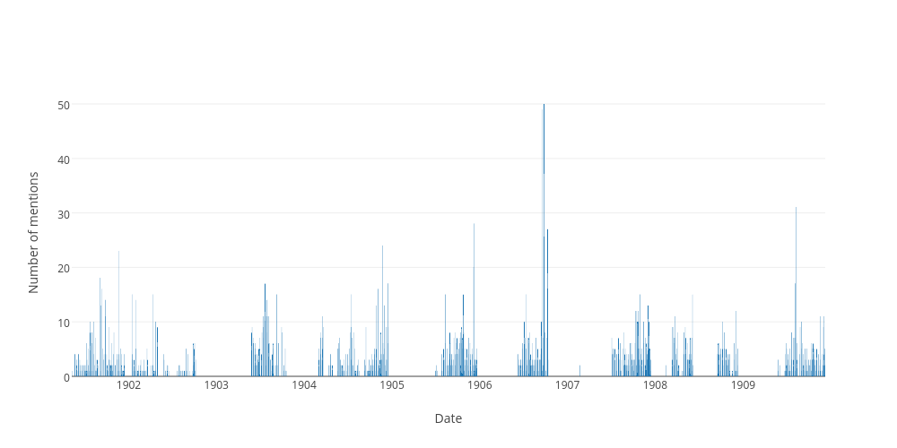

## Sitting days when the word "british" was used in the hofreps during the 1900s

| Date | Number of uses |
|--------------|----------------|
|1906-09-25|50|
|1906-09-19|49|
|1909-08-10|31|
|1905-12-07|28|
|1906-10-10|27|
|1904-11-23|24|
|1901-11-19|23|
|1905-12-06|20|
|1906-09-26|19|
|1901-09-04|18|
|1903-07-22|17|
|1904-12-14|17|
|1909-08-06|17|
|1904-11-03|16|
|1901-09-12|16|
|1902-01-14|15|
|1903-09-09|15|
|1908-06-04|15|
|1905-08-10|15|
|1907-10-29|15|
|1904-07-13|15|
|1905-10-24|15|
|1902-04-10|15|
|1906-07-11|15|
|1903-07-29|14|
|1901-09-26|14|
|1902-01-29|14|
|1903-07-21|13|
|1907-12-02|13|
|1904-10-28|13|
|1904-11-29|13|
|1901-09-06|13|
|1907-10-16|12|
|1907-10-10|12|
|1908-12-03|12|
|1907-10-23|12|
|1909-12-02|11|
|1903-07-23|11|
|1904-03-18|11|
|1903-07-30|11|
|1901-09-25|11|
|1903-08-05|11|
|1903-08-04|11|
|1909-11-17|11|
|1908-03-24|11|
|1903-07-14|11|
|1906-09-13|10|
|1906-09-14|10|
|1908-10-06|10|
|1906-07-05|10|
|1907-12-06|10|
|1907-10-17|10|
|1907-10-18|10|
|1909-08-31|10|
|1901-07-25|10|
|1907-10-22|10|
|1907-11-14|10|
|1907-11-12|10|
|1901-08-07|10|
|1902-04-23|10|
|1905-10-17|9|
|1909-12-01|9|
|1904-03-22|9|
|1908-03-13|9|
|1908-03-17|9|
|1902-04-30|9|
|1904-12-08|9|
|1908-05-05|9|
|1904-12-13|9|
|1904-09-14|9|
|1901-10-09|9|
|1904-07-15|9|
|1903-05-29|9|
|1903-09-29|9|
|1903-07-15|9|
|1909-08-26|9|
|1905-10-12|8|
|1903-09-30|8|
|1905-10-26|8|
|1901-10-31|8|
|1909-07-20|8|
|1909-07-22|8|
|1905-08-29|8|
|1903-07-31|8|
|1905-09-19|8|
|1904-07-27|8|
|1903-05-27|8|
|1908-04-29|8|
|1908-10-14|8|
|1904-11-15|8|
|1903-07-09|8|
|1904-03-08|8|
|1907-08-22|8|
|1904-07-12|8|
|1906-09-28|8|
|1906-07-26|8|
|1901-07-31|8|
|1901-07-24|8|
|1908-04-02|8|
|1905-10-11|7|
|1906-08-23|7|
|1907-08-01|7|
|1908-06-03|7|
|1906-10-05|7|
|1904-05-26|7|
|1905-10-20|7|
|1905-08-30|7|
|1909-07-28|7|
|1904-03-16|7|
|1905-09-15|7|
|1908-05-07|7|
|1908-05-06|7|
|1907-11-22|7|
|1909-08-03|7|
|1909-08-04|7|
|1905-09-28|7|
|1903-06-02|7|
|1901-08-14|7|
|1903-07-01|7|
|1907-07-04|7|
|1904-03-09|7|
|1904-07-19|7|
|1906-09-20|7|
|1906-07-24|7|
|1905-11-16|7|
|1908-03-25|7|
|1908-03-20|7|
|1903-07-16|7|
|1908-05-27|7|
|1908-05-26|7|
|1906-07-10|7|
|1906-07-19|7|
|1905-10-18|6|
|1905-10-10|6|
|1901-10-23|6|
|1905-08-31|6|
|1907-08-08|6|
|1903-06-10|6|
|1908-03-18|6|
|1907-09-18|6|
|1909-08-12|6|
|1903-08-06|6|
|1902-10-02|6|
|1904-05-24|6|
|1901-07-10|6|
|1903-08-11|6|
|1903-06-04|6|
|1907-12-03|6|
|1904-12-15|6|
|1909-06-30|6|
|1903-05-28|6|
|1907-09-24|6|
|1907-11-25|6|
|1908-11-25|6|
|1905-09-26|6|
|1903-06-03|6|
|1906-06-28|6|
|1903-09-10|6|
|1903-09-15|6|
|1903-09-17|6|
|1907-10-09|6|
|1903-08-25|6|
|1901-07-23|6|
|1906-08-09|6|
|1905-11-21|6|
|1909-09-03|6|
|1908-09-23|6|
|1904-11-24|6|
|1907-11-15|6|
|1902-09-26|6|
|1908-05-13|6|
|1907-09-20|6|
|1905-10-25|6|
|1906-07-25|6|
|1909-10-13|6|
|1909-10-19|6|
|1905-08-09|6|
|1908-09-18|6|
|1901-08-01|6|
|1901-07-30|6|
|1909-11-03|5|
|1909-07-15|5|
|1907-11-07|5|
|1909-12-06|5|
|1905-10-19|5|
|1903-10-14|5|
|1905-11-08|5|
|1905-11-02|5|
|1909-09-22|5|
|1909-10-22|5|
|1907-10-24|5|
|1906-06-26|5|
|1904-05-20|5|
|1904-05-25|5|
|1903-08-26|5|
|1908-12-10|5|
|1908-10-22|5|
|1905-08-03|5|
|1904-03-17|5|
|1909-10-14|5|
|1901-07-18|5|
|1905-10-05|5|
|1906-08-30|5|
|1904-07-28|5|
|1907-12-09|5|
|1901-11-27|5|
|1904-10-20|5|
|1907-11-26|5|
|1902-09-30|5|
|1902-01-30|5|
|1908-10-15|5|
|1903-06-30|5|
|1905-08-17|5|
|1904-03-03|5|
|1907-08-21|5|
|1907-08-29|5|
|1905-11-29|5|
|1909-09-02|5|
|1907-12-10|5|
|1904-12-01|5|
|1908-09-29|5|
|1909-07-01|5|
|1902-03-18|5|
|1904-10-27|5|
|1908-10-07|5|
|1903-06-26|5|
|1903-06-12|5|
|1901-09-13|5|
|1909-09-16|5|
|1908-04-01|5|
|1907-07-17|5|
|1907-07-10|5|
|1907-10-31|5|
|1902-08-27|5|
|1904-07-06|5|
|1905-12-18|5|
|1906-07-12|5|
|1906-09-12|4|
|1907-07-09|4|
|1907-11-01|4|
|1909-12-03|4|
|1908-11-04|4|
|1908-11-05|4|
|1905-09-05|4|
|1905-09-07|4|
|1904-10-07|4|
|1907-07-26|4|
|1907-07-24|4|
|1902-01-16|4|
|1902-05-01|4|
|1903-06-19|4|
|1903-06-11|4|
|1909-10-20|4|
|1909-10-21|4|
|1907-09-17|4|
|1907-09-12|4|
|1902-10-01|4|
|1903-08-21|4|
|1908-10-29|4|
|1901-06-05|4|
|1901-06-06|4|
|1902-09-03|4|
|1901-05-22|4|
|1904-03-10|4|
|1901-05-21|4|
|1904-04-19|4|
|1901-12-03|4|
|1905-11-30|4|
|1901-09-20|4|
|1901-11-20|4|
|1908-09-30|4|
|1901-10-01|4|
|1907-09-25|4|
|1904-04-21|4|
|1907-11-28|4|
|1905-09-21|4|
|1908-12-01|4|
|1908-04-28|4|
|1906-07-31|4|
|1904-06-29|4|
|1904-06-23|4|
|1901-09-27|4|
|1902-05-27|4|
|1904-11-17|4|
|1904-11-16|4|
|1909-11-24|4|
|1901-11-14|4|
|1903-07-07|4|
|1903-07-08|4|
|1907-07-05|4|
|1907-08-27|4|
|1901-12-12|4|
|1905-11-22|4|
|1909-09-07|4|
|1901-10-30|4|
|1909-06-24|4|
|1905-10-04|4|
|1908-09-22|4|
|1904-11-25|4|
|1904-10-19|4|
|1909-11-10|4|
|1909-07-06|4|
|1908-04-30|4|
|1904-10-26|4|
|1905-11-14|4|
|1908-03-26|4|
|1908-09-16|4|
|1908-09-17|4|
|1907-09-05|4|
|1901-08-09|4|
|1909-08-25|4|
|1907-07-11|4|
|1905-07-27|4|
|1908-05-21|4|
|1908-05-28|4|
|1906-06-07|4|
|1906-06-08|4|
|1906-09-11|3|
|1909-07-07|3|
|1907-11-06|3|
|1908-11-03|3|
|1909-09-14|3|
|1903-07-28|3|
|1902-03-04|3|
|1905-09-06|3|
|1902-02-20|3|
|1902-01-15|3|
|1906-08-29|3|
|1906-08-22|3|
|1908-05-19|3|
|1908-05-14|3|
|1907-08-06|3|
|1905-11-01|3|
|1905-11-07|3|
|1901-10-10|3|
|1909-09-21|3|
|1908-03-11|3|
|1908-03-12|3|
|1909-10-26|3|
|1905-11-24|3|
|1907-09-10|3|
|1907-10-25|3|
|1909-08-11|3|
|1909-08-13|3|
|1902-04-29|3|
|1902-10-09|3|
|1901-06-11|3|
|1907-10-03|3|
|1906-06-14|3|
|1906-06-19|3|
|1903-08-20|3|
|1906-06-29|3|
|1906-07-04|3|
|1906-09-06|3|
|1906-09-05|3|
|1908-10-20|3|
|1908-10-28|3|
|1904-09-29|3|
|1904-09-28|3|
|1909-07-21|3|
|1909-07-29|3|
|1905-08-24|3|
|1904-03-15|3|
|1901-08-21|3|
|1901-08-23|3|
|1904-12-06|3|
|1905-09-14|3|
|1904-12-09|3|
|1904-09-08|3|
|1901-07-11|3|
|1907-10-08|3|
|1901-09-19|3|
|1903-08-12|3|
|1903-08-13|3|
|1904-10-21|3|
|1907-09-26|3|
|1907-09-27|3|
|1907-11-27|3|
|1901-10-16|3|
|1908-11-26|3|
|1904-10-13|3|
|1904-11-11|3|
|1906-06-21|3|
|1901-05-30|3|
|1908-10-13|3|
|1909-09-30|3|
|1902-05-28|3|
|1906-08-07|3|
|1904-11-18|3|
|1908-03-31|3|
|1909-10-07|3|
|1902-03-20|3|
|1901-11-12|3|
|1906-08-01|3|
|1904-03-02|3|
|1904-03-04|3|
|1905-11-23|3|
|1901-11-22|3|
|1904-07-14|3|
|1904-06-16|3|
|1907-12-13|3|
|1909-11-19|3|
|1904-10-18|3|
|1909-05-27|3|
|1907-11-13|3|
|1904-08-12|3|
|1908-05-15|3|
|1902-01-23|3|
|1906-07-27|3|
|1907-08-14|3|
|1903-06-23|3|
|1909-10-15|3|
|1905-08-08|3|
|1904-05-31|3|
|1906-10-12|3|
|1907-11-29|3|
|1906-08-17|3|
|1906-08-14|3|
|1905-12-19|3|
|1908-05-22|3|
|1908-05-29|3|
|1906-07-18|3|
|1905-12-13|3|
|1905-12-12|3|
|1905-12-14|3|
|1908-10-30|2|
|1905-10-13|2|
|1901-10-24|2|
|1901-10-22|2|
|1901-06-12|2|
|1907-11-05|2|
|1909-12-08|2|
|1902-02-12|2|
|1903-07-24|2|
|1905-09-08|2|
|1905-09-01|2|
|1904-10-05|2|
|1901-07-04|2|
|1902-07-31|2|
|1906-08-21|2|
|1904-06-08|2|
|1904-06-09|2|
|1904-06-02|2|
|1905-11-09|2|
|1904-06-01|2|
|1901-12-13|2|
|1903-06-18|2|
|1909-09-29|2|
|1909-09-24|2|
|1903-06-16|2|
|1908-03-19|2|
|1909-06-02|2|
|1909-10-27|2|
|1909-10-28|2|
|1907-09-13|2|
|1908-12-08|2|
|1907-10-01|2|
|1906-06-13|2|
|1906-06-15|2|
|1909-07-13|2|
|1906-07-06|2|
|1903-09-04|2|
|1904-11-08|2|
|1904-11-09|2|
|1909-11-30|2|
|1909-12-07|2|
|1905-08-22|2|
|1904-03-11|2|
|1901-08-28|2|
|1905-08-04|2|
|1902-06-11|2|
|1902-06-12|2|
|1902-02-19|2|
|1904-12-02|2|
|1902-07-29|2|
|1901-07-16|2|
|1905-07-05|2|
|1904-04-14|2|
|1901-12-02|2|
|1908-05-08|2|
|1903-06-09|2|
|1908-06-05|2|
|1904-07-21|2|
|1904-07-20|2|
|1904-09-13|2|
|1904-04-13|2|
|1903-05-26|2|
|1901-10-03|2|
|1907-11-21|2|
|1907-11-20|2|
|1902-04-09|2|
|1902-04-02|2|
|1905-09-20|2|
|1905-09-27|2|
|1907-10-15|2|
|1906-06-27|2|
|1906-06-20|2|
|1906-06-22|2|
|1903-08-27|2|
|1904-10-06|2|
|1901-05-29|2|
|1903-09-11|2|
|1904-06-28|2|
|1907-08-30|2|
|1905-10-31|2|
|1909-10-06|2|
|1905-08-16|2|
|1909-10-05|2|
|1901-07-03|2|
|1907-11-19|2|
|1907-02-21|2|
|1901-08-13|2|
|1905-12-05|2|
|1906-08-08|2|
|1901-05-23|2|
|1906-08-02|2|
|1906-08-03|2|
|1908-10-21|2|
|1907-08-23|2|
|1909-09-08|2|
|1909-09-09|2|
|1907-12-11|2|
|1906-08-10|2|
|1906-09-21|2|
|1908-10-27|2|
|1901-10-18|2|
|1904-04-20|2|
|1901-10-15|2|
|1901-10-17|2|
|1904-04-27|2|
|1904-10-14|2|
|1904-10-11|2|
|1909-11-16|2|
|1909-07-02|2|
|1902-09-25|2|
|1904-08-11|2|
|1909-06-29|2|
|1901-10-02|2|
|1902-04-11|2|
|1908-02-14|2|
|1901-06-04|2|
|1903-10-08|2|
|1904-11-02|2|
|1908-10-09|2|
|1905-11-10|2|
|1903-06-25|2|
|1901-06-21|2|
|1901-06-27|2|
|1901-06-26|2|
|1901-11-05|2|
|1901-11-06|2|
|1905-08-02|2|
|1907-09-06|2|
|1907-09-03|2|
|1904-06-07|2|
|1907-07-16|2|
|1906-08-16|2|
|1906-07-17|2|
|1907-10-30|2|
|1902-01-24|2|
|1904-08-09|2|
|1908-04-07|2|
|1909-09-10|2|
|1908-04-08|2|
|1908-04-09|2|
|1905-12-16|2|
|1904-07-05|2|
|1905-12-11|2|
|1904-09-30|1|
|1906-09-18|1|
|1904-06-15|1|
|1901-10-25|1|
|1909-11-04|1|
|1909-11-02|1|
|1907-11-08|1|
|1901-06-14|1|
|1909-07-14|1|
|1909-07-16|1|
|1902-09-10|1|
|1908-11-06|1|
|1902-02-11|1|
|1906-08-28|1|
|1902-06-03|1|
|1902-03-05|1|
|1902-03-07|1|
|1904-10-04|1|
|1905-06-30|1|
|1901-07-05|1|
|1901-07-02|1|
|1908-10-01|1|
|1903-10-15|1|
|1907-07-25|1|
|1907-07-23|1|
|1901-07-09|1|
|1902-07-30|1|
|1909-11-18|1|
|1907-08-09|1|
|1907-08-02|1|
|1901-09-05|1|
|1909-09-28|1|
|1909-09-23|1|
|1909-10-29|1|
|1907-09-11|1|
|1906-10-02|1|
|1909-09-01|1|
|1902-10-03|1|
|1907-10-04|1|
|1903-10-21|1|
|1906-09-04|1|
|1904-09-23|1|
|1908-04-23|1|
|1904-11-04|1|
|1901-06-07|1|
|1902-09-02|1|
|1905-08-23|1|
|1901-12-05|1|
|1902-02-26|1|
|1902-02-27|1|
|1901-08-20|1|
|1901-08-22|1|
|1902-06-10|1|
|1902-06-19|1|
|1904-09-09|1|
|1902-02-18|1|
|1902-08-07|1|
|1905-06-29|1|
|1901-07-12|1|
|1902-07-22|1|
|1901-07-19|1|
|1905-07-07|1|
|1908-11-17|1|
|1904-06-14|1|
|1901-12-09|1|
|1908-05-01|1|
|1908-06-01|1|
|1903-08-19|1|
|1904-07-29|1|
|1907-12-04|1|
|1907-12-05|1|
|1901-11-26|1|
|1901-11-21|1|
|1909-10-12|1|
|1901-10-08|1|
|1909-08-05|1|
|1904-08-02|1|
|1907-10-02|1|
|1904-08-04|1|
|1908-11-27|1|
|1905-09-29|1|
|1905-09-22|1|
|1904-05-18|1|
|1908-12-02|1|
|1908-12-04|1|
|1902-08-06|1|
|1908-04-24|1|
|1904-06-24|1|
|1908-12-11|1|
|1904-11-10|1|
|1909-11-26|1|
|1904-09-22|1|
|1901-11-15|1|
|1904-09-20|1|
|1909-07-30|1|
|1901-08-16|1|
|1905-12-08|1|
|1901-07-26|1|
|1906-07-03|1|
|1901-12-11|1|
|1907-08-28|1|
|1905-11-28|1|
|1907-12-12|1|
|1909-06-23|1|
|1904-12-07|1|
|1909-06-25|1|
|1904-09-27|1|
|1908-09-24|1|
|1904-10-12|1|
|1905-10-27|1|
|1909-11-11|1|
|1909-07-08|1|
|1909-07-09|1|
|1909-05-26|1|
|1902-09-24|1|
|1904-08-10|1|
|1904-08-18|1|
|1902-02-06|1|
|1902-02-07|1|
|1902-02-05|1|
|1902-04-15|1|
|1902-04-18|1|
|1902-03-12|1|
|1901-05-31|1|
|1903-10-09|1|
|1904-10-25|1|
|1902-08-13|1|
|1902-01-21|1|
|1902-01-28|1|
|1907-08-13|1|
|1905-11-15|1|
|1901-06-20|1|
|1905-08-01|1|
|1907-08-07|1|
|1907-09-04|1|
|1901-08-02|1|
|1901-08-06|1|
|1908-04-03|1|
|1901-05-09|1|
|1909-07-27|1|
|1905-07-26|1|
|1906-08-15|1|
|1902-04-22|1|
|1902-04-24|1|
|1908-05-20|1|
|1909-09-15|1|
|1902-08-20|1|
|1902-08-28|1|
|1906-07-13|1|
|1905-12-15|1|
