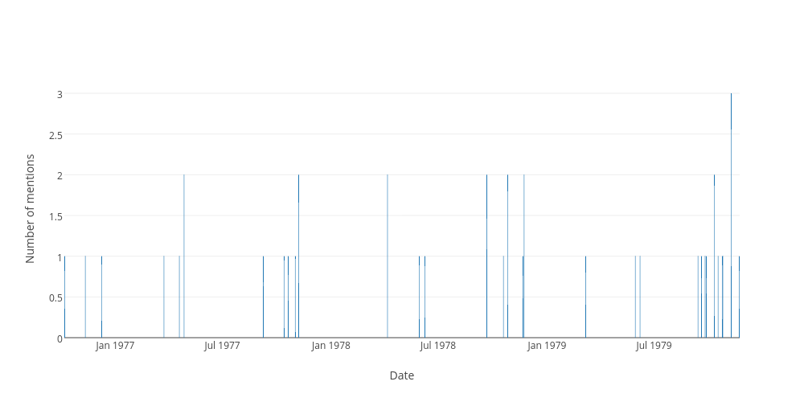

## Sitting days when the word "multiculturalism" was used in the hofreps during the 1970s

| Date | Number of uses |
|--------------|----------------|
|1979-11-08|3|
|1978-11-23|2|
|1979-10-11|2|
|1978-10-26|2|
|1977-11-07|2|
|1978-04-06|2|
|1977-04-27|2|
|1978-09-21|2|
|1979-09-13|1|
|1979-09-19|1|
|1979-11-22|1|
|1978-11-21|1|
|1977-03-24|1|
|1979-03-07|1|
|1979-10-17|1|
|1977-04-19|1|
|1977-10-20|1|
|1979-09-27|1|
|1979-09-25|1|
|1977-10-13|1|
|1979-10-24|1|
|1977-11-01|1|
|1979-05-30|1|
|1978-05-30|1|
|1976-12-09|1|
|1979-10-25|1|
|1978-06-08|1|
|1976-10-07|1|
|1977-09-08|1|
|1976-11-11|1|
|1978-10-19|1|
|1979-06-07|1|
