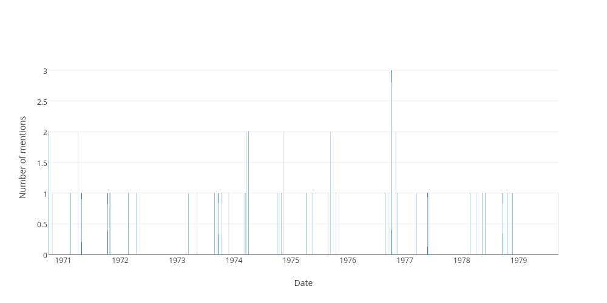

## Sitting days when the word ""white australia"" was used in the hofreps during the 1970s

| Date | Number of uses |
|--------------|----------------|
|1976-10-05|3|
|1974-04-04|2|
|1971-04-07|2|
|1974-03-20|2|
|1976-11-03|2|
|1975-09-10|2|
|1970-09-30|2|
|1974-11-13|2|
|1979-09-12|1|
|1973-03-15|1|
|1971-04-29|1|
|1972-04-12|1|
|1975-05-22|1|
|1975-08-28|1|
|1976-09-21|1|
|1978-11-22|1|
|1971-10-26|1|
|1971-10-28|1|
|1971-02-17|1|
|1974-10-30|1|
|1974-10-17|1|
|1970-09-29|1|
|1973-10-09|1|
|1973-09-25|1|
|1977-05-26|1|
|1977-06-02|1|
|1978-05-11|1|
|1970-10-22|1|
|1975-10-15|1|
|1971-10-13|1|
|1976-08-26|1|
|1978-11-17|1|
|1978-04-05|1|
|1977-03-16|1|
|1975-04-08|1|
|1973-11-28|1|
|1973-08-29|1|
|1978-06-01|1|
|1974-03-14|1|
|1972-02-23|1|
|1974-10-03|1|
|1973-05-09|1|
|1974-03-12|1|
|1976-11-17|1|
|1978-10-19|1|
|1978-09-21|1|
|1973-09-12|1|
|1978-02-22|1|
